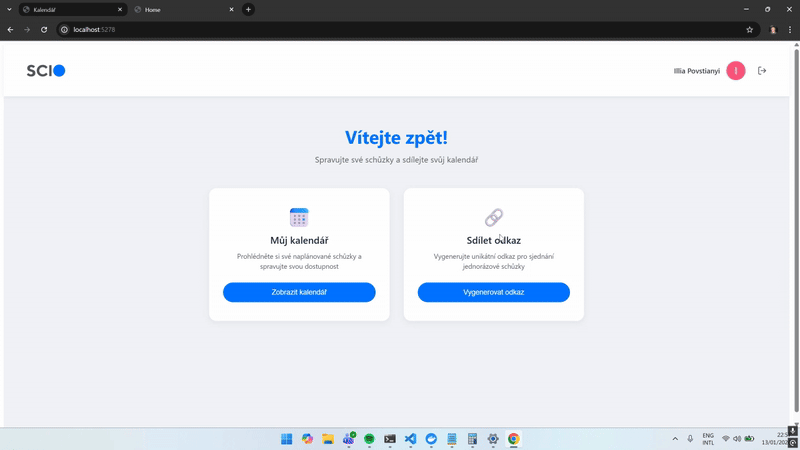
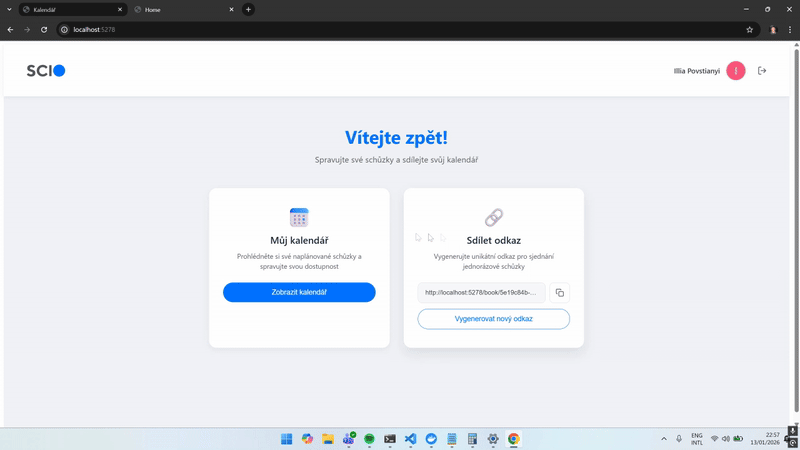
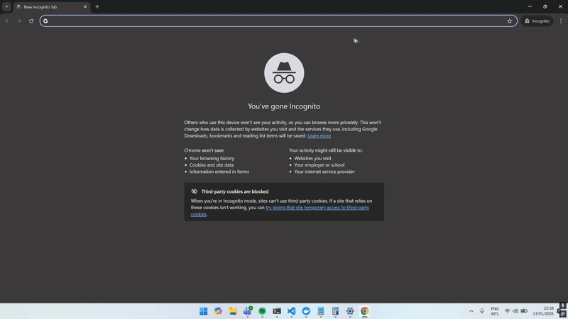

# MeetingScheduler-Technical-Task
Technický úkol pro společnost SCIO – webová aplikace pro sjednávání schůzek.

Aplikace umožňuje uživatelům generovat unikátní odkazy, přes které si mohou ostatní sjednat schůzku. Po přihlášení přes Google účet dostanete odkaz, který sdílíte, a kdokoliv si pak může vybrat volný termín ve vašem kalendáři.

...

# Ukázka funkčnosti
Přihlášení:

Generování odkazu:

Kalendář:

Sjednaní:

# Tech Stack:
.NET 8.0 SDK
Docker 
SQL Server
Entitiy framework
Blazor

# Nastavení OAuth
Získejte přihlašovací údaje z Google Cloud Console

Redirect URI:
https://localhost:<Port>>/signin-google

Spusťte tyto příkazy s VAŠIMI přihlašovacími údaji:
dotnet user-secrets set "Authentication:Google:ClientId" "YOUR_ID"
dotnet user-secrets set "Authentication:Google:ClientSecret" "YOUR_SECRET"

# Nastavení SQL Server
Spuštění SQL Serveru:
docker run -d \
  --name sqlserver-db \
  -e "ACCEPT_EULA=Y" \
  -e "SA_PASSWORD=YourStrong!Password" \
  -p 1433:1433 \
  mcr.microsoft.com/mssql/server:2022-latest

Zkopírujte appsettings.Development.json.example do appsettings.Development.json
Nastavte heslo k SQL Serveru v ConnectionStrings.DefaultConnection
Spusťte:
dotnet ef database update

# Spuštění programu: 
dotnet run